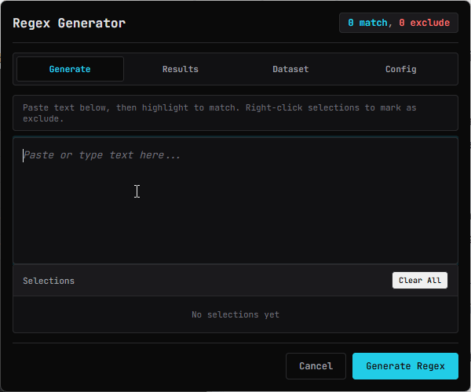

# regspy

regspy is a regex pattern generator, you enter some data -> select what you want matched and or not matched -> ??? -> Pattern!



This project started as me trying to learn dspy, its vibe coded to shit and back but it works and has some accomplishments:
 - Runs on small models with 3B parameter at a minimum, so it should run on anything.
 - It outperforms grex ~~in metrics that were defined by me~~.
 - Learns from what you feed it, it generated a pattern you liked? add it to the training set!
 - No human written prompts or rules or "make sure to NOT explode" bs.
 - Context aware generation, it learns from failed patterns and most importantly WHY it failed.
 - Generates patterns based on a scoring system that ranks patterns by:
	 - **matches_all**: Percentage of required items the pattern matches
	 - **excludes_all**: Percentage of excluded items the pattern avoids
		 - *If no excluded items are selected, this metrics weights are divided equally amongst the others.*
	 - **coherence**: How similar extra matches are to target items
	 - **generalization**: Use of character classes (\\d, \\w) vs literals
	 - **simplicity**: How short patterns are and without the use of branching

Is it perfect? hell no, the training set, scoring system, hint generation could be improved upon, so if you want have a go at it i included a CLAUDE.md for you.

But if you're a everyday smooth brain like me that needs a simple pattern on the fly because for some reason your brain is physically impossible of remembering that lookaheads exist, regspy should be of some help. 

## Features

- **Visual Text Selection**: Highlight text to create match examples (cyan) or exclusions (red)
- **LLM-Powered Generation**: Uses local Ollama with qwen2.5-coder:3b for intelligent pattern creation
- **Training Dataset**: 227+ curated examples with ability to add your own
- **Pre-compilation**: Optional rule extraction for faster runtime inference
- **Session Config**: Adjust model, temperature, and scoring weights on the fly

## Installation

- **AutoHotkey v2.0** - [Download](https://www.autohotkey.com/)
- **Python Libs**:
  ```bash
  pip install dspy grex ollama
  ```
- **Ollama**:
  ```bash
  ollama serve
  ollama pull qwen2.5-coder:3b
  ```
- **Run**:
  ```bash
  AutoHotkey64.exe regspy.ahk # Or just double click regspy.ahk
  ```

### CLI flags

```bash
# Run test suite
python regexgen.py --test

# Pre-compile for faster runtime
python regexgen.py --compile

# Generate regex from JSON input
python regexgen.py input.json output.json

# With custom config
python regexgen.py input.json output.json --config config.json

# Dataset management
python regexgen.py --list-dataset output.json
python regexgen.py --add-example example.json
python regexgen.py --delete-example <index>
```

## Architecture

```
┌─────────────────┐     ┌─────────────────┐     ┌─────────────────┐
│   AutoHotkey    │────▶│  Web Frontend   │────▶│     Python      │
│   (Host)        │◀────│  (WebView2)     │◀────│   (DSPy/LLM)    │
└─────────────────┘     └─────────────────┘     └─────────────────┘
     Window              Text Selection          Regex Generation
     Management          Highlighting            Multi-criteria
     IPC Bridge          Results Display         Scoring
```

## Configuration

The Config tab allows session-level adjustments:

- **Model**: Ollama model name (default: `qwen2.5-coder:3b`)
- **Temperature**: LLM creativity (default: 0.4)
- **Max Attempts**: Refinement iterations (default: 10)
- **Reward Threshold**: Stop early if score exceeds (default: 0.85)
- **Scoring Weights**: Adjust the 5 criteria weights
- **Context Window** (`num_ctx`): Ollama context size (default: 8192). Ollama defaults to 4096 which can truncate prompts with many training examples. If you see "truncating input prompt" warnings in Ollama logs, bump this up. Uses ~200MB extra VRAM per 4K increase on 3B models.